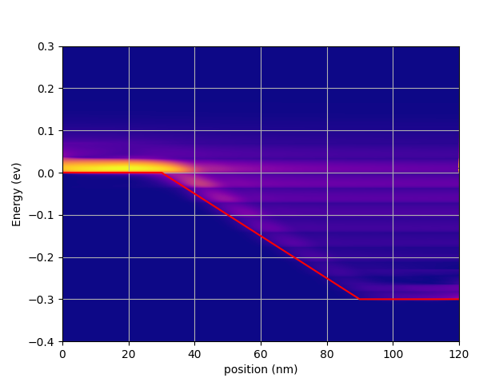
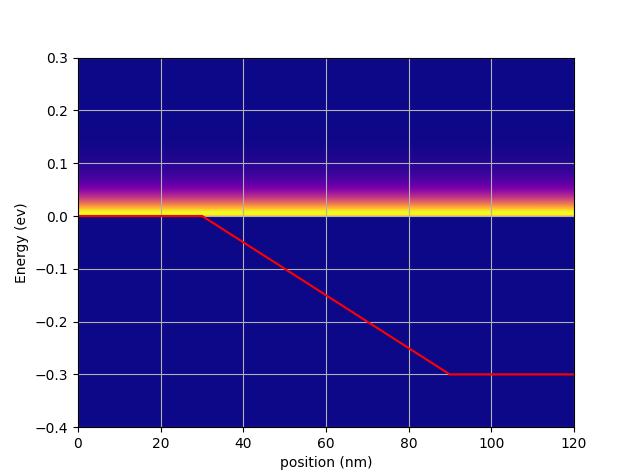
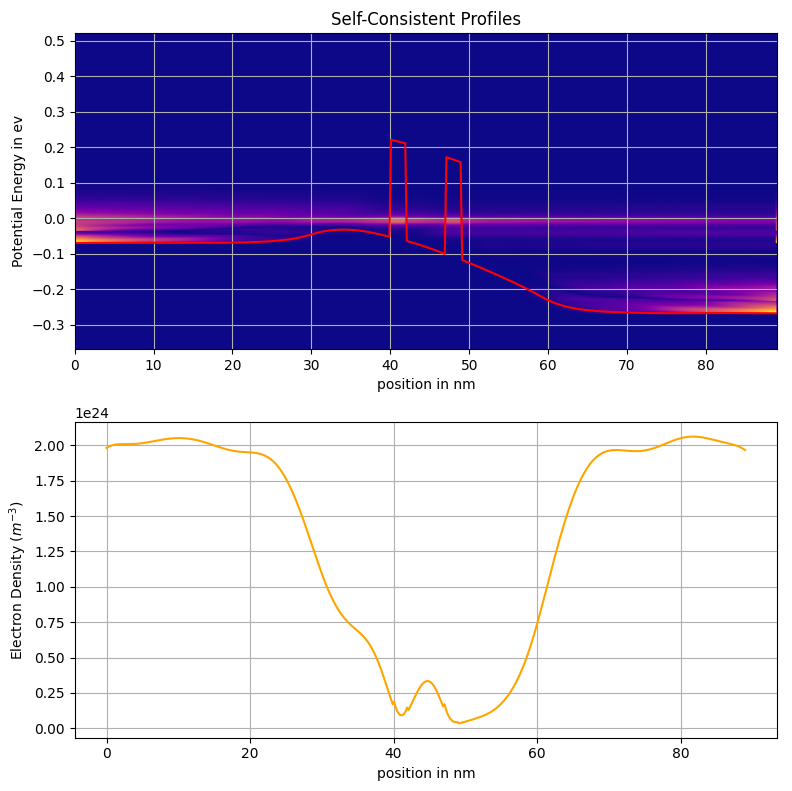
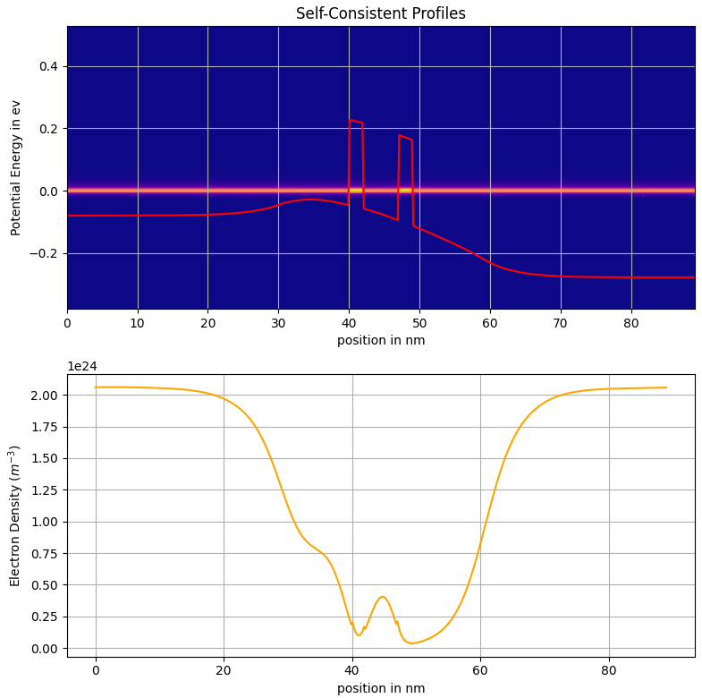
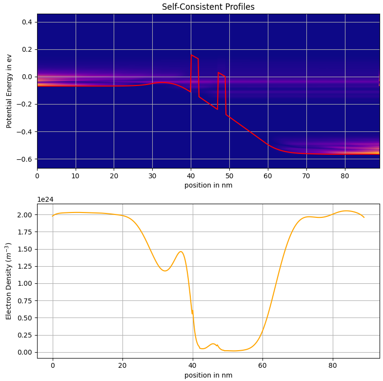
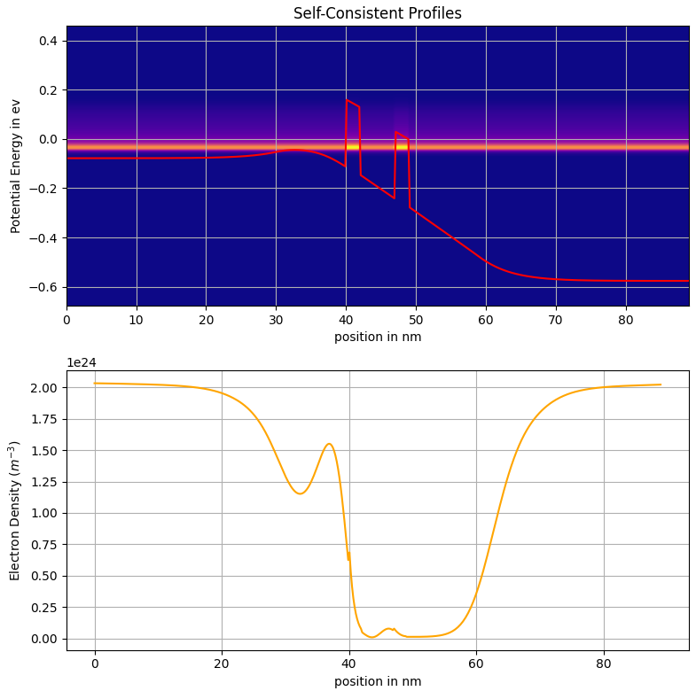

# NEGF-solver
Simulate quantum transport in RTD using NEGF formalism for Ballistc and Dissipative scenarios. 

Self consistency is also implemented in this solver.

Here, all the device parameters are contained in the `device_profiles.py` file. Edit those parameters for different configurations. 

**Note: If the `L` is changed, make sure to re-cache `QTNEGF.py` or `NEGF.py` as numba doesn't cache these files, if there are no changes made to them**

To run this solver, run the command `python3 wrapper.py`. It should start the solver for the defined device, after all the needed libraries are installed. This runs both the Ballistic and Dissipative with self consistency. Instead of using the wrapper, It is possible to directly run `QTNEGF.py` or `NEGF.py` after un-commenting the supporting code at the end of the files. These are the obtained plots

*linear potential drop with phonon relaxation. T(E) Vs x and Ec Vs x at 0.3V*

*linear potential drop without phonon relaxation. T(E) Vs x and Ec Vs x at 0.3V*

*Conduction band and Electron concentration profile, for RTD, with phonons, with self consistency at 0.25V*

*Conduction band and Electron concentration profile, for RTD, without phonons, with self consistency at 0.25V*

*Conduction band and Electron concentration profile, for RTD, with phonons, with self consistency at 0.5V*

*Conduction band and Electron concentration profile, for RTD, without phonons, with self consistency at 0.5V*
